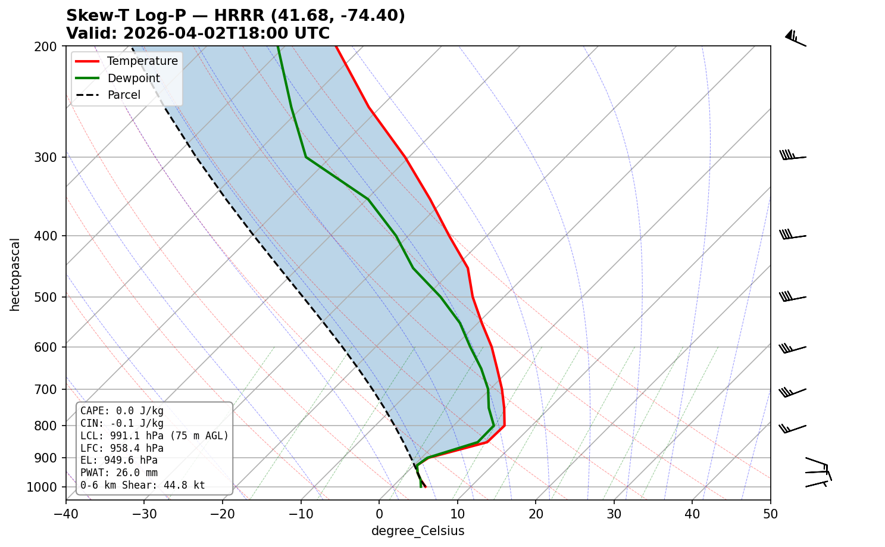

# skewt-mcp

An MCP (Model Context Protocol) server that generates **Skew-T Log-P diagrams** from weather model data for any coordinates. Designed for pilots, paragliders, and weather nerds who use AI assistants.

No API key needed — uses free [Open-Meteo](https://open-meteo.com/) data (which blends HRRR, GFS, and other models).



## What You Can Ask Your AI

Once installed, just talk naturally:

> "Show me the skew-t for Ellenville, NY at 2pm"

> "What does the sounding look like for 37.7749, -122.4194 tomorrow at 18Z?"

> "Pull a skew-t for the Torrey Pines launch site — is it thermic today?"

> "Get me the sounding data for my home airport, I want to check the inversion layer"

The MCP tool description tells the AI when and how to call it:

> *Generate a Skew-T Log-P diagram for given coordinates and time. Returns a PNG image and key thermodynamic indices (CAPE, CIN, LCL, LFC, EL, PWAT).*

## Example Output

For Ellenville Flight Park (41.67, -74.40) at 18Z:

```
CAPE: 0.0 J/kg
CIN: -0.1 J/kg
LCL: 991.1 hPa (75 m AGL)
LFC: 958.4 hPa
EL: 949.6 hPa
PWAT: 26.0 mm
0-6 km Shear: 44.8 kt
```

Plus a full Skew-T diagram with temperature (red), dewpoint (green), parcel path (dashed), wind barbs, CAPE/CIN shading, dry/moist adiabats, and mixing ratio lines.

## Features

- **Skew-T diagrams** with temperature, dewpoint, parcel path, wind barbs, CAPE/CIN shading, dry/moist adiabats, and mixing ratio lines
- **Computed indices**: CAPE, CIN, LCL, LFC, EL, precipitable water, 0-6 km bulk shear
- **Data source**: Open-Meteo API (free, no API key) — uses best available model blend including HRRR for CONUS
- **GFS fallback**: If the default model fails, automatically falls back to GFS
- **MCP transport**: stdio — works with Claude Desktop, Claude Code, and any MCP client

## Installation

```bash
pip install skewt-mcp
```

Or from source:

```bash
git clone https://github.com/keithmgould/skew-t_mcp
cd skew-t_mcp
pip install -e .
```

## MCP Client Configuration

### Claude Desktop

Add to your `claude_desktop_config.json`:

```json
{
  "mcpServers": {
    "skewt": {
      "command": "python",
      "args": ["-m", "skewt_mcp"]
    }
  }
}
```

### Claude Code

```bash
claude mcp add skewt -- python -m skewt_mcp
```

## Tools

### `get_skewt`

Generate a Skew-T Log-P diagram for given coordinates and time.

**Parameters:**
| Parameter | Type | Required | Default | Description |
|-----------|------|----------|---------|-------------|
| `latitude` | float | ✅ | — | Latitude in decimal degrees |
| `longitude` | float | ✅ | — | Longitude in decimal degrees |
| `forecast_hour` | int | ❌ | current hour | Hour in UTC (0-23) |
| `date` | string | ❌ | today | Date in YYYY-MM-DD format |
| `model` | string | ❌ | `"hrrr"` | `"hrrr"` or `"gfs"` |

**Returns:** PNG image (base64) + text summary with CAPE, CIN, LCL, LFC, EL, PWAT, and wind shear.

### `get_sounding_data`

Get raw sounding data as JSON for programmatic use. Same parameters as `get_skewt`.

**Returns:** JSON with pressure levels, temperatures, dewpoints, wind speed/direction, and all computed indices. Useful for custom analysis or when you don't need the image.

## How It Works

1. Fetches pressure-level data (1000–200 hPa, 19 levels) from the Open-Meteo API
2. Computes dewpoints from temperature + relative humidity (Magnus formula)
3. Calculates thermodynamic indices using [MetPy](https://unidata.github.io/MetPy/)
4. Renders the Skew-T diagram with matplotlib + MetPy's SkewT class
5. Returns the image as base64 PNG + a text summary

## Development

```bash
git clone https://github.com/keithmgould/skew-t_mcp
cd skew-t_mcp
pip install -e ".[dev]"
pytest
```

## Dependencies

- [MetPy](https://unidata.github.io/MetPy/) — meteorological calculations + Skew-T plotting
- [matplotlib](https://matplotlib.org/) — rendering
- [httpx](https://www.python-httpx.org/) — async HTTP client
- [mcp](https://github.com/modelcontextprotocol/python-sdk) — MCP Python SDK

## License

MIT
